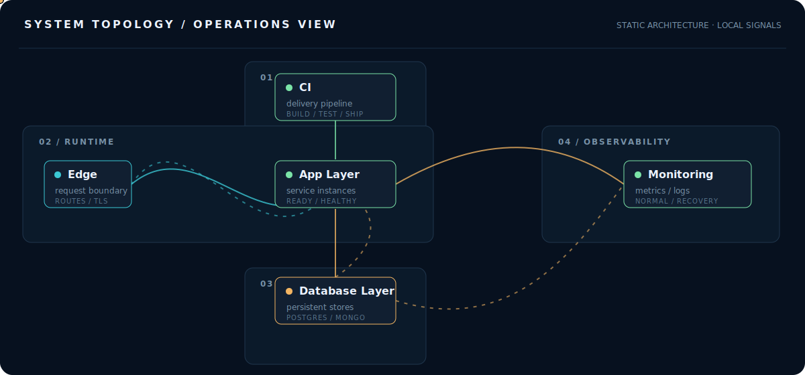

# Gajan Rajah

**DEVOPS ENGINEER**  
**COLOMBO / KANDY · REMOTE / HYBRID**

> I design, automate, and operate cloud platforms from resilient OpenShift environments to calmer, more observable delivery workflows.

**AVAILABLE FOR PLATFORM & SYSTEMS ENGINEERING**

---

  

---

## Selected Deployments

### OpenShift Platform Engineering
Production-oriented cluster delivery, Ceph storage, Velero backups, Ansible automation, network policies, and operational guardrails.

### Homelab / gajan.dev
A personal systems lab built around Google Cloud, Kubernetes, GitLab CI, Prometheus, Grafana, Helm, Docker, and Cloudflare.

### Zelvo
Receipt-aware expense tracking with Docker, GCP, NeonDB, Prisma, Auth0, OCR, and intelligent document processing.

### NuBred
Agriculture and plant variety management platform delivered with React, Node.js, Docker, NeonDB, Prisma, Clerk, and Hetzner.

### NoteMate
AI-powered note-taking platform combining React Native, Spring Boot, AWS services, Kubernetes, CI/CD, and observability.

---

## Operating Stack

| Area | Tools |
| --- | --- |
| Platforms | OpenShift, Kubernetes, Docker, OpenShift Virtualization, VMware |
| Infrastructure | Ceph, Rook, NFS, LVM, PVCs, network bonding |
| Delivery | GitOps, CI/CD Pipelines, Ansible, Helm, Bash, Python |
| Cloud | AWS, GCP, Cloudflare |
| Observability | Prometheus, Grafana, Node Exporter, MySQL exporters, health checks |
| Data and recovery | PostgreSQL, MySQL, MongoDB, Velero, MinIO |
| Application systems | Node.js, Express, Mongoose |
| Security | Web App Security, network policies, ACLs, OSINT |

---

## Production Troubleshooting

- Coordinating releases and major-version upgrades with test plans, impact analysis, and rollback procedures.
- Automating patching and migrations with CI/CD and Ansible.
- Provisioning single-node, multi-node, on-premises, and K3s OpenShift environments.
- Managing VMware migrations, Ceph storage, Rook, NFS, LVM, local storage, and PVC mapping.
- Building Prometheus and Grafana monitoring with exporters, health checks, log management, and image pruning.
- Automating cluster, database, and namespace backups with Velero and MinIO.
- Configuring network policies, HAProxy, routes, DNS, ACLs, and security rules.

---

## Certifications

- Red Hat Certified OpenShift Administrator, Red Hat, 2025
- Red Hat System Administration I (RH124), Version 10.0, Red Hat, 2025
- Advent of Cyber 2025, TryHackMe
- Containers & Kubernetes Essentials, IBM, 2024
- Back End Development and APIs, freeCodeCamp, 2024
- Advent of Cyber 2023, TryHackMe
- SQL (Intermediate), HackerRank, 2023
- Python (Basic), HackerRank, 2023
- AWS Educate Introduction to Cloud 101, AWS, 2023
- The Complete Web Developer, Zero to Mastery Academy, 2021
- JavaScript Algorithms and Data Structures, freeCodeCamp, 2020
- Responsive Web Design, freeCodeCamp, 2020
- Diploma in Web Development, ESOFT Metro Campus, 2019
- Diploma in Information Technology, ESOFT Metro Campus, 2018

---

## Technical Writing

Procedure writing, deployment notes, knowledge transfer, impact analysis, and recovery documentation that shorten the path from alert to action.

---

## Connect

- [LinkedIn](http://www.linkedin.com/in/gajanrajah)
- [Medium](https://medium.com/@trikto)
- [GitHub](https://github.com/trikto)
- [GitLab](https://gitlab.com/trikto)
- [Portfolio](https://gajan-devops-portfolio.gajanrajah22.chatgpt.site)
